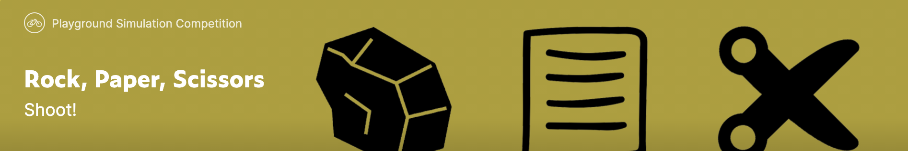

# Rock_Paper_Scissors

Kaggle diary for Rock, Paper, Scissors competition

このリポジトリはRock, Paper, Scissors competitionのKaggle日記です。

## コンペ情報
強化学習コンペ、内容は極めてシンプル、ジャンケンを1000回行って、多く勝ったほうが勝ち。 
一見、究極の運ゲーと思ったが、他の人を出し抜くために色々な人が色々な工夫を凝らしてエージェントを
作成するので、randomを使う運ゲーでは上位に行くことはできない。
興味深いことに、完全な運ゲーであるのにも関わらず、(参加者の多さだけで判断しているだけだが)Santaコンペよりもレベルは高い気がする。なんか上に行くのは難しそう。

## Timeline
1/16 joined
2/2  deadline
Santa2020とdeadlineが同じ...

##　目標
金　上位12
銀　上位74
銅　上位148

one-chance 銅メダルの気持ちで、そこまで熱心にやるつもりはない。

### 1/16
geometryカーネルと、np.randomを混ぜたエージェントを作成した。randomを選択する確率も乱数によって決定づけられている。閾値を0.2~0.6に変化させて、動向を確認した。
Notebook name: rock_paper_scissors_geometry_random

| ランダム率 | 名前 | スコア |
|----|----|----|
|0.2|version1|560|
|0.3|version2|820|
|0.4|version3|440|
|0.5|version4|610|
|0.6|中止|中止|

当たり前だが、簡単に1000付近には到達しない。次にgeometryカーネルと、last_opponent_killを混ぜたエージェントを作成した。また、ランダム率の幅も狭くした(同時に変えるのは本来は好ましくないが、まあまだ実験序盤だしいいかな)
Notebook name:rock_paper_scissors_geometry_last_opp_kill

| ランダム率 | 名前 | スコア |
|----|----|----|
|0.26|version6|550|
|0.28|version7|680|
|0.30|version8|500|
|0.32|version9|600|
|0.34|中止||

ここで、フォークしたもとのカーネルを見ると、スコアが1000を超えていた。元のがそんなに強いのか...しかし、上位に行くと読まれるであろう。ランダムは少し混ぜる。

| ランダム率 | 名前 | スコア |
|----|----|----|
|0|カーネル|1000|
|0.001|version10||
|0.05|version11||
|0.1|version12||

フォークしたもとのカーネルを少し読んだが、何言っているか良くわからなかった。ただ、複素数を予測に使っていることだけ分かった。120°回転が手に対応している?
